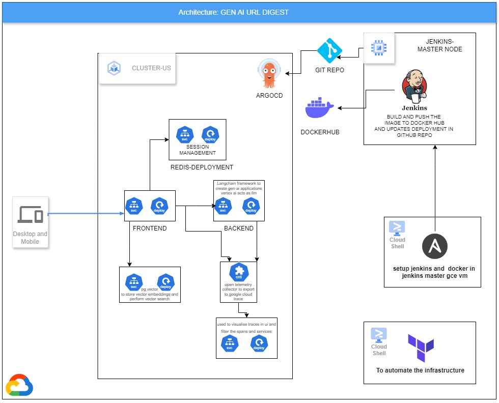
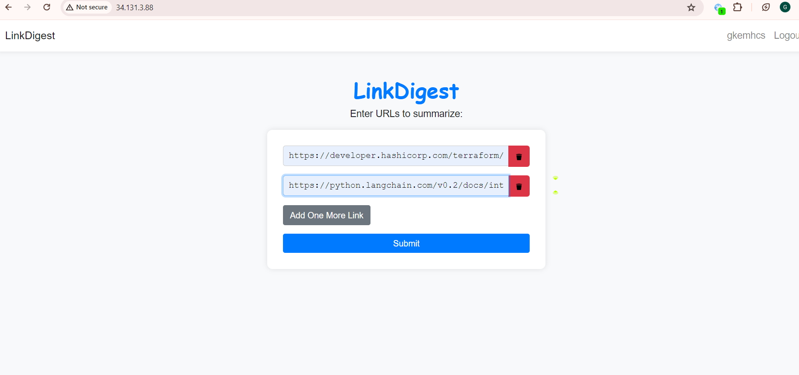
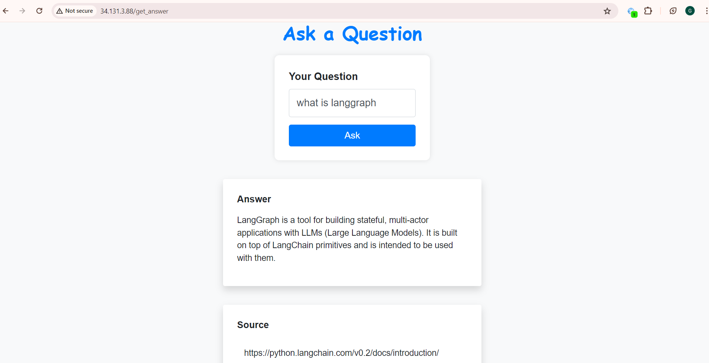
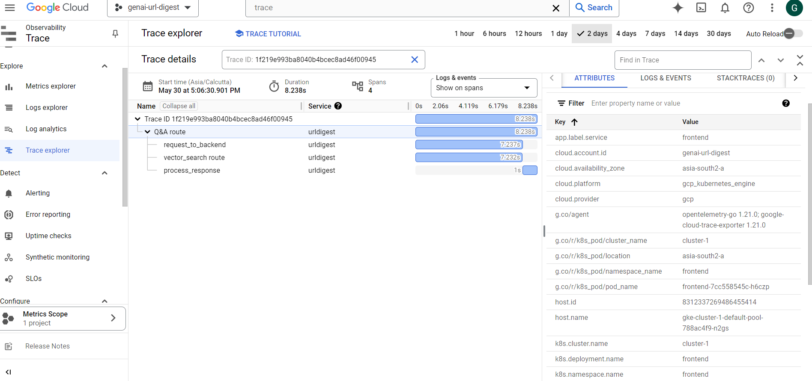

# GENAI-URL-DIGEST💻 
### -  A simple  **GENAI-RAG** microservice deployed in gke and implemented observability through opentelemetry and configured jenkins  and docker  for ci through ansible 
### Tools Used:-
- **Google Kubernetes Engine**: To deploy the micrsoervices and openetelemtetry deployments 
- **OpenTelemetry**: To increase observability by implementing distributed tracing 
- **Langchain**:  To create a llm based rag app 
- **VertexAI**: To serve as llm for website and create embeddings 
- **Jenkins** :  jenkins master server on **GCE VM INSTANCE**  to manage ci of image builds
- **OpenTelemetry operator for Kubernetes**:  deployed on *Google Kubernetes engine* to implement opentelemetry in kubernetes.
- **Ansible**:   configuration management tool to configure docker  and jenkins on **GOOGLE COMPUTE VM** to prepare a jenkins master node
- **PGVector**: deployed as a k8s pod to store generated embeddings and perform vector search over database
- **Terraform**: to automate the infrastructure 

###  Website Images 
##### Project Architecture


##### POST url page


##### Q&A Page 



##### Sample Cloud Trace dashboard


####  trace info


###⚠️ Requirements to Deploy the Project :
- **Make sure you have installed Docker and gcloud cli in your local workstation**
- **Ensure you have an active Google Cloud Account**
- **If not created ,create a dockerhub account to push the docker images and  note down the username and password 🔑**


### Steps to deploy the project **GENAI-URL-DIGEST**

**First Clone this repo to your local workstation or shell**


### Method1:- Local Deployment 


**Step1: First  replace the PROJECT_ID  with your PROJECT_ID**
```bash
export PROJECT_ID=PROJECT_ID
gcloud config set project $PROJECT_ID
gcloud services enable aiplatform.googleapis.com
```
**Step2: Download service-account key for injecting into backend service to authenticate to Google Cloud Vertext AI**
```bash
gcloud iam service-accounts create aiplatform-user 

gcloud projects add-iam-policy-binding $PROJECT_ID  \
--member "serviceAccount:aiplatform-user@${PROJECT_ID}.iam.gserviceaccount.com" \
--role roles/aiplatform.user

gcloud iam service-accounts keys create key.json \
--iam-account "aiplatform-user@${PROJECT_ID}.iam.gserviceaccount.com"
```

**Step3: Now deploy all services using docker compose file**
```bash
# first  build the images 
docker compose build
## run the services
docker compose -d up
```
**Step4: To destroy the services run docker compose command**

```bash
docker compose down
```

### Method2:- Cloud deployment 


**Step1: First  replace the *PROJECT_ID* WITH YOUR PROJECT_ID**
```bash
export PROJECT_ID=PROJECT_ID
gcloud config set project $PROJECT_ID
``` 

**Step2: Now install required apis for project**
```bash
gcloud services enable cloudresourcemanager.googleapis.com \
aiplatform.googleapis.com compute.googleapis.com \
container.googleapis.com 
```
**Step3: Creating a  GCS_BUCKET to serve as a remote backend for terraform to store statefile**
```bash
BUCKET_NAME=$PROJECT_ID+"-url-digest-tf"
gsutil -l us-central1 gs://$BUCKET_NAME
```
**Step4: Generating a ssh-key to add to vm to configure the vm through Ansible**
```bash
ssh-keygen -C "gudikotieswarmani@gmail.com" -b 2048 -t rsa -f "~/.ssh/gce-ssh-ansible"   -N ""
sed -i "s/PROJECT_ID/${PROJECT_ID}/" ansible/gcp_compute.yaml

```
**Step5: Run the terraform script to deploy the infrastructure**
```bash
cd infra 
terraform init
export TF_VAR_PROJECT_ID=$PROJECT_ID
export TF_VAR_SSH_USERNAME=gkemhcs
export TF_VAR_SSH_PUBLIC_KEY_FILE=~./ssh/gce-ssh-ansible 
sed -i "s/BUCKET_NAME/${BUCKET_NAME}/" provider.tf
terraform plan 
terraform apply -auto-approve
```
**Now infrastructure is deployed successfully .**
**Step 6 :Now we need to configure the vm as jenkins master node through ansible**

```bash
cd ../ansible
ansible-playbook playbook.yaml -i gcp_compute.yaml 
cd ..
```
**jenkins master node is successfully configured**

**Now we need to create jenkins pipelines  for backend and frontend service**

**Step 7: SSH into GCE VM instance and get the jenkins admin password**
```bash
EXTERNAL_IP=$(gcloud compute instances describe jenkins-master --zone us-central1-a  --format "value(networkInterfaces[0].accessConfigs[0].natIP)")
ssh -i ~/.ssh/gce-ssh-ansible gkemhcs@${EXTERNAL_IP}
##AFTER CONNECTING TO JENKINS-MASTER VM  RUN THE BELOW COMMAND to get jenkins ADMIN password
sudo cat /var/lib/jenkins/secrets/initialAdminPassword
```
**Step 8: Updating the dockerhubusername**
```bash
echo "Enter your DockerHub username"
read DOCKER_HUB_USER_NAME
sed -i "s/DOCKER_HUB_USER_NAME/${DOCKER_HUB_USER_NAME}/"  src/frontend/Jenkinsfile
sed -i "s/DOCKER_HUB_USER_NAME/${DOCKER_HUB_USER_NAME}/" src/backend/Jenkinsfile
sed -i "s/DOCKER_HUB_USER_NAME/${DOCKER_HUB_USER_NAME}/" k8s/backend-deployment.yaml
sed -i "s/DOCKER_HUB_USER_NAME/${DOCKER_HUB_USER_NAME}/" k8s/frontend-deployment.yaml
```

**Step 9: Jenkins  Pipelines section**

**Now go through the url http://{EXTERNAL_IP_OF_JENKINS_VM}:8080 to access jenkins UI**
-  If jenkins prompts you to enter password paste the above password you got by reading a file 
-  Then click on install selected plugins 
- after installation jenkins ui prompts you to create  user and password ,do it.

**Now Go to  your github  account  and create a github personal  github token besides create a personal access token in your  dockerhub account**
- Install the  docker pipelines plugin in jenkins server, this enables to run docker as jenkins agents to run jenkins pipelines 

##### Now create two global credentials in jenkins  named  github-token and  docker-hub-credentials

-  For github-token create a jenkins credentials of type secrettext and seret contains the github token you have created previously
- For docker-hub-credentials  create a jenkins credentials of type user and password in such a way user contains your dockerhub userid ,password contains your dockerhub access token


###### Now push this directory to your github to configure pipelines with scm with your  github repo
Sample pipeline screenshot


Now create two  jenkins pipelines

- **Frontend-Pipeline:-** create a jenkins pipeline named frontend-pipeline
   - In definition field select  Pipeline script from SCM
   - IN SCM field choose Git
   - In Repository URL field paste your github repo for which you have pushed previously from this directory
   - In Branch Specifier replace the text with */main
   - In Script path replace the text Jenkinsfile with src/frontend/Jenkinsfile

- **Backend-Pipeline:-** create a jenkins pipeline named backend-pipeline
   - In definition field select  Pipeline script from SCM
   - IN SCM field choose Git
   - In Repository URL field paste your github repo for which you have pushed previously from this directory
   - In Branch Specifier replace the text with */main
   - In Script path replace the text Jenkinsfile with src/backend/Jenkinsfile

**Now docker images are successfully built its time to deploy the services onto gke cluster**

**Step 10: Now install argocd into gke cluster to automate the deployment of services and opentelemetry manifests**
```
gcloud container clusters get-credentials cluster-us --zone us-central1-a 
###    Installing argocd 
kubectl create ns argocd 
kubectl apply -n argocd -f https://raw.githubusercontent.com/argoproj/argo-cd/stable/manifests/install.yaml
```
**Step 11: Apply Argocd Application manifest to create project**
###### ! Note :- Note of your GITHUB REPO URL you need to enter in below step

```bash
read GITHUB_REPO_URL
sed -i "s/GITHUB_REPO_URL/${GITHUB_REPO_URL}/" Application.yaml

kubectl apply -f Application.yaml 
kubectl get svc frontend -n frontend
```


**Copy the above External IP  and  go through the url http://{EXTERNAL_IP} to access the application**


###HOW TO DELETE THE PROJECT

**To delete the project simply run  the terraform destroy command**
```bash
cd infra 
terraform destroy
gsutil rm gs://$BUCKET_NAME
```
